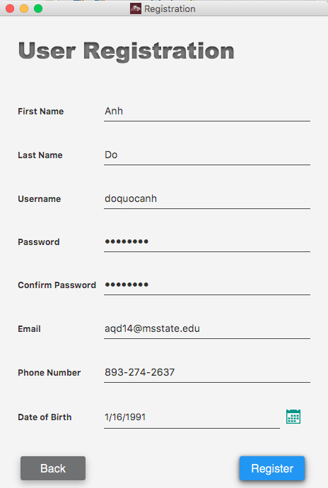
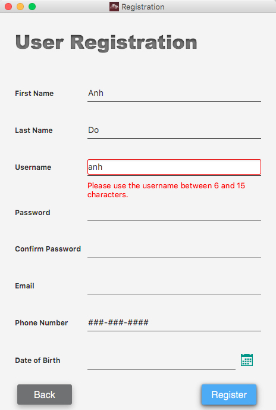
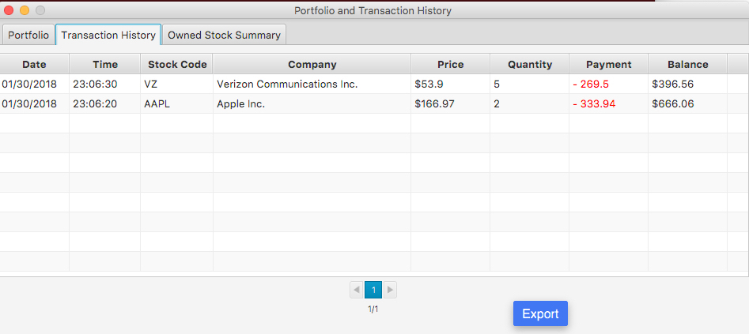
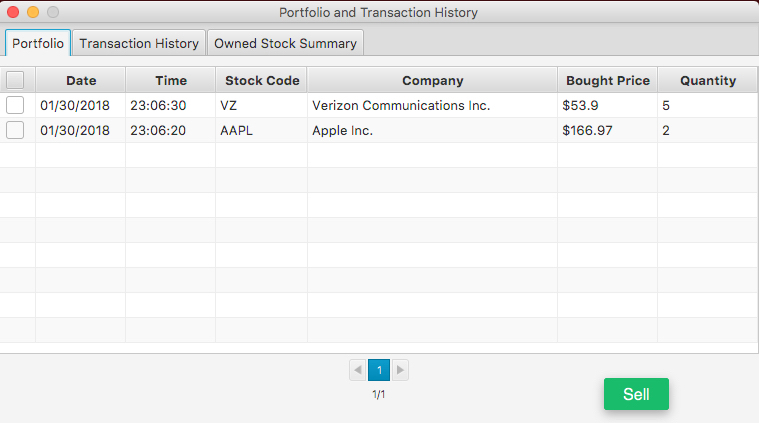

### stock-tracker -BY Ajinkya (JinxStocks)
Simple javafx application that assists users keeping track of stock trends to make decision.


# Contents  
* [Setup](#setup)  
* [Functionality](#functionality)
    * [Login](#login)
        * [Reset username/password](#functionality)
        * [Registration](#registration)
        * [Main Screen](#main-screen)
            * [Search in interested stocks](#search-in-interested-stocks)
            * [Remove stock / set alert](#remove-stock-and-set-alert)
            * [Add stock](#add-stock)
            * [Buy stock](#buy-stock)
            * [Settings](#settings)
            * [Portfolio](#portfolio)
            * [Display list of interested stocks](#functionality)

## Setup

1. Clone project by using ```git clone```
```
    https://github.com/ajinkyaspatil20/JinxStocks.git
```
2. Build project with ```maven```
```
mvn jfx:jar
```
3. Run ```jar``` file at $SOURCE_DIR$/target/jfx/app
```
java -jar path_to_jar_file
```

## Functionality
### Login


When user starts the app, Login screen will be opened. User can login either by registered email or username.

Beside the main function is logging user in the app, there are several options. User can:
+ Remember username/password so there is no need to enter them next time login
+ Register Account
+ Reset Password

If the username/password is incorrect, an error message will be displayed to user.

### Reset username/password


User can reset password by providing some needed personal information that user has registered earlier.

### Registration
User need to enter some basic information in order to register for the app.
<p align="left">


</p>

The app restricts some rules on registered information such as:
+ Length of username, password should be sufficiently long
+ Should give a correct email (e.g., ajinkyaspatil2011@gmai.com)
+ First name/ last name should not contain special characters (e.g., %@&^%*#^)
+ ...

### Main screen

#### Display list of interested stocks

After succesfully logged in, user will be redirect to the main screen. It includes default 30 stocks and their current price changes compared to the price of last closing day of stock market. User can also add/remove prefered stocks and the configuration will be saved for next log in.


#### Search in interested stocks

If user is interested in too many stock and it's hard to find one, he can user the **Search** option on the right hand. The matched results will display when user typing.


#### Remove stock and set alert

User can remove the stocks that he no longer interested in by right clicking on the stock. He can also set the price alert for that stock and whenever the price reaches set value, an email and a text message will be sent to registered email and phone number.


We support three types of alert:
1. Value alert -- notify user if the stock price reached the set value
2. Combined value alert -- notify user if the total value of those owned stocks (e.g., AAPL) reached the set value
3. Net profit alert -- notify user if with the current stock price, user can get profit equal to the set value

#### Add stock

User can add stocks by using the **Click** button. The app incorporates the stocks from two stock markets, NASDAQ and NYSE.


#### Buy stock

User can ungenuinely buy certain stocks. The buying cost will be deducted to user's sample account balance. User can keep track of the stock price trend in different time period to make a decision.


#### Settings

User can update personal information by using **Settings** menu item.


#### Portfolio

This feature helps user keeping track of portfolio, transaction history, selling stocks, etc..

<p align="left">


</p>

User can export the transaction history to excel file for his own reference.
